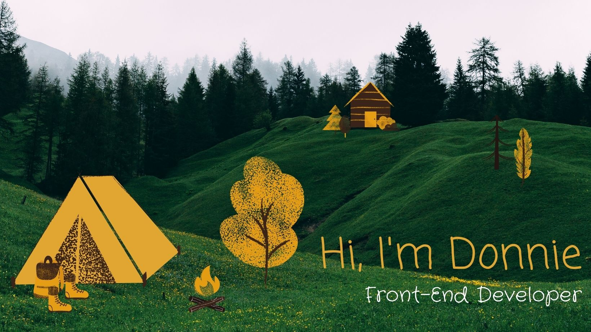

## I'm a Front-End Developer based in midcoast Maine.

I am a full-featured engineer who enjoys the process of turning
great designs into working software. I have nearly a decade of
experience developing software in various capacities. I've built
websites, widgets, and large, responsive web applications. I care
about working efficiently and effectively and can help development
teams maximize their value through process improvements. I can even
develop and manage a product backlog.

I care about building great experiences and writing clean, simple
code. In everything, I believe humans come first. I began my career
as a front-end developer in 2011 and specialize in JavaScript, HTML, CSS, React, and Redux development.

There isn't much to see on my [CodePen](https://codepen.io/donniehyde), but feel free to check it out.

You can find out more about my development experience on [LinkedIn](https://www.linkedin.com/in/donaldhyde/) or by downloading my [resume](./files/donaldHydeResume.pdf).

<!--
**DonaldHyde/donaldhyde** is a ✨ _special_ ✨ repository because its `README.md` (this file) appears on your GitHub profile.

Here are some ideas to get you started:

- 🔭 I’m currently working on ...
- 🌱 I’m currently learning ...
- 👯 I’m looking to collaborate on ...
- 🤔 I’m looking for help with ...
- 💬 Ask me about ...
- 📫 How to reach me: ...
- 😄 Pronouns: ...
- ⚡ Fun fact: ...
-->
